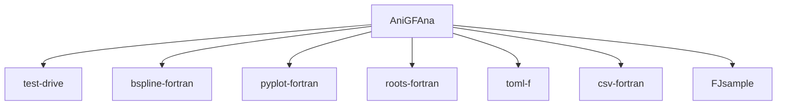

# AnisoGradientFlowAnalysis
A repository to do the analysis of the Gradient Flow output files from the ancillary files of arXiv: 1203.4469 for the purposes of gauge anisotropy determination and scale setting (lattice spacing determination).

Specifically the code takes a `toml` input file detailing the various parameters and data files, determines the anisotropy using the $R_E$ method as in arXiv: 1205.0781 and then determines the (spatial) lattice spacing using the $W_0$ scale approach. At all stages, [b-splines](https://github.com/jacobwilliams/bspline-fortran) are used to interpolate between the flow anisotropy values.


---
## Outputs

The two executables `w0RE` (jackknife) and `w0RE_boot` (bootstrap) produce similar output files. Both produce a set of plots - `fortW0RE[_boot]_XI.pdf` where XI is replaced with the appropriate number. These show

$$ W_{ij}(\tau) = \left[\tau\frac{d}{d\tau}\,\tau^2\left\langle E_ss (\tau)\right\rangle\right]$$

and

$$ \xi_w^2\,W_{4i}(\tau) = \left[\tau\frac{d}{d\tau}\,\tau^2\left\langle E_st (\tau)\right\rangle\right]$$


where $E_{ss}$ and $E_{st}$ are the spatial and temporal contributions to the action density. Also produces are `fortW0RE[_boot]_{as/RE}.pdf` which show the interpolations used to determine $\xi_g$ and $a_s$. These two final plots also shown the final numerical results in the legend.

Note that that all `pdf` files have an associated `.py` which is the minimal python script required to reproduce the plot.

Additionally we save a set of csv files containing the bootstraps or the jackknifes. For the jackknife files, the `config` refers to which configuration was excluded in the single-elimination jackknife. For the bootstraps, this is instead the `bootID` which can be mapped to the "samples" used via the `FortBootSampleIDs.csv` file. The IDs then are mapped to the configuration using the `FortBootConfigIDs.csv` file.


In the future, the correct way to update the spacing if $w_0^{Phys}$ is updated and you don't want to rerun the analysis is to use the `w0ij(xig)` column of i.e. `Fort{Jacks/Boots}.csv`. This is the value for the $w_0-scale$ evaluated at the (interpolated) value of $\xi_g$. This could also be imported into i.e. [pyerrors](https://github.com/fjosw/pyerrors), a python data analysis suite that uses the $\Gamma$-method to determine the autocorrelation.

This can be done using the `app/processPyErrors.py` python program which uses the jackknife version `w0RE`. It can be run using i.e.

```
python processPyErrors.py /scratch/dp006/dc-bign2/gen3/NF2P1/wflow/256x24_Analysis/SYM/FortJacks.csv 256x24 0.17355 0.00092 FLAG
```

By default it will redo & print the analysis assuming no auto-correlation (S=0.0) and with the standard py-errors value (S=2.0). It will also save pyerrors forms of $\xi_g$, $a_s$, $a_\tau$ and $w_0^{Phys}$ to i.e. `/scratch/dp006/dc-bign2/gen3/NF2P1/wflow/256x24_Analysis/SYM/jacks_Pyerrors.json.gz`.


---
## Building
This repository uses the [fortran-lang/fpm](https://github.com/fortran-lang/fpm) to build. See the instructions below on how to get this. This package manager automatically gets the quired dependencies from GitHub. If there is no internet connection or git available you will need acquire them manually and then modify the `fpm.toml` file to i.e.
```
[dependencies]
stdlib = { path = 'myrelativepathto/stdlib'}
```


## How to install the FPM

See the instructions [here](https://fpm.fortran-lang.org/install/index.html)
If you are on a Linux distro and have any Fortran compiler installed, do:
```
git clone https://github.com/fortran-lang/fpm
cd fpm
./install.sh
```

This will put the fpm in your `$HOME/.local/bin`

## How to change the FPM config

To build, simply: `fpm build`


To run: `fpm run -- FULL_PATH_TO_TOML_FILE`

## pre-commit hooks

The repo also comes with a pre-commit that will ensure a formatting for your Fortran files. You can install pre-commits by using:

```
python -m pip install pre-commit
pre-commit install
```

---
## Dependencies:

